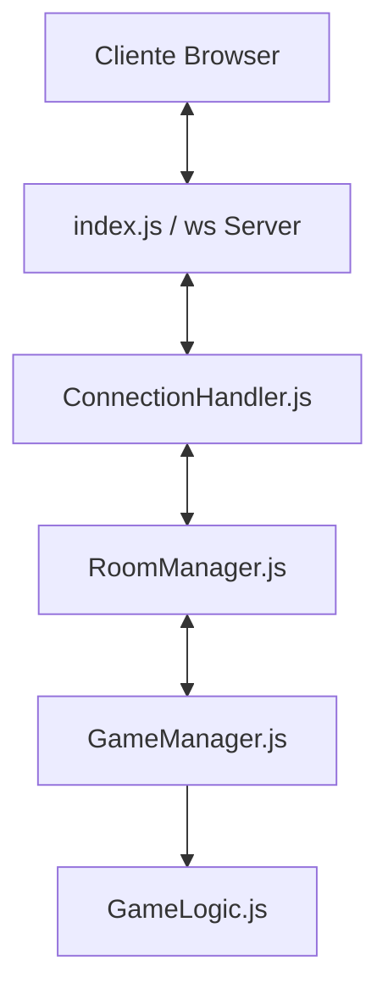
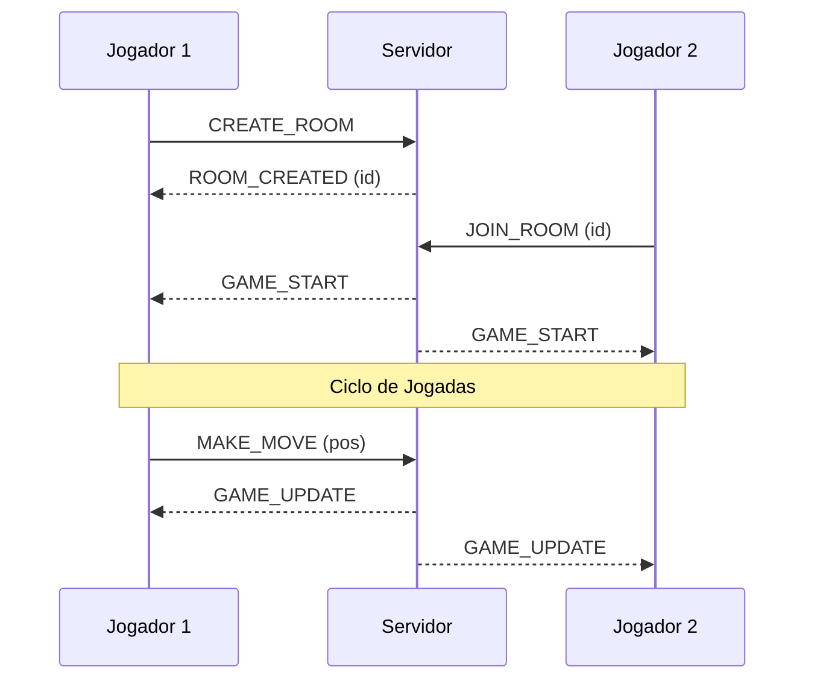

# Tech Spec — Jogo da Velha Multiplayer (Arquitetura Simples)

## 1. Arquitetura de Camadas

### Estrutura de Pastas
```
📦 tic-tac-toe-multiplayer
 ┣ 📂 server/
 ┃ ┣ 📜 index.js               # Entry point: HTTP server + WS server
 ┃ ┣ 📂 modules/
 ┃ ┃ ┣ 📜 GameLogic.js         # Regras puras do jogo
 ┃ ┃ ┣ 📜 GameManager.js       # Estado das partidas ativas
 ┃ ┃ ┣ 📜 RoomManager.js       # Gerenciamento de salas
 ┃ ┃ └── 📜 ConnectionHandler.js # Roteamento de mensagens WS
 ┃ └── 📂 tests/
 ┃     ┣ 📜 GameLogic.test.js
 ┃     └── 📜 GameManager.test.js
 ┣ 📂 client/
 ┃ ┣ 📜 index.html             # Frontend (HTML + Tailwind CSS)
 ┃ ┣ 📂 js/
 ┃ ┃ ┣ 📂 communication/
 ┃ ┃ ┃ └── 📜 socket.js        # Cliente WebSocket
 ┃ ┃ ┣ 📂 presentation/
 ┃ ┃ ┃ └── 📜 ui.js            # Manipulação do DOM
 ┃ ┃ └── 📜 game.js            # Orquestrador do cliente
 ┃ ┗ 📂 css/
 ┃   ┗ 📜 style.css            # Estilos customizados (Tailwind extra)
 ┣ 📜 package.json
 ┗ 📜 GEMINI.md
```

### Responsabilidades
O sistema será estruturado em camadas com responsabilidades bem definidas, seguindo o fluxo de dependências: `index.js -> ConnectionHandler -> RoomManager -> GameManager -> GameLogic`.

- **`GameLogic.js` (Lógica Pura):** Contém as regras do jogo (validar jogada, verificar vitória/empate). Não possui estado e não conhece WebSockets.
- **`GameManager.js` (Estado da Partida):** Gerencia o estado de uma partida específica (tabuleiro, turno, jogadores).
- **`RoomManager.js` (Gestão de Salas):** Responsável por criar salas, adicionar jogadores e gerenciar o ciclo de vida das salas em memória.
- **`ConnectionHandler.js` (Infraestrutura):** Ponto de entrada das mensagens WebSocket. Roteia os eventos para o `RoomManager`.
- **`index.js` (Entrada):** Inicializa o servidor HTTP e o servidor WebSocket (`ws`).

## 2. Frontend (Cliente)
- **Tecnologias:** HTML5 e **Tailwind CSS** (via CDN para simplicidade ou via CLI se necessário).
- **UI:** Design responsivo, moderno e focado na experiência do usuário.
- **Protocolo:** Todas as mensagens são objetos JSON serializados: `{ "type": "TIPO", "payload": {} }`.

### Eventos Cliente -> Servidor
- `CREATE_ROOM`: `{ "playerName": string }`
- `JOIN_ROOM`: `{ "roomId": string, "playerName": string }`
- `MAKE_MOVE`: `{ "roomId": string, "position": number }`
- `REMATCH`: `{ "roomId": string }`

### Eventos Servidor -> Cliente
- `ROOM_CREATED`: `{ "roomId": string }`
- `GAME_START`: `{ "board": array, "symbol": "X" | "O", "turn": "X" | "O" }`
- `GAME_UPDATE`: `{ "board": array, "turn": "X" | "O" }`
- `GAME_OVER`: `{ "winner": "X" | "O" | null, "board": array }`
- `OPPONENT_LEFT`: `{}`
- `ERROR`: `{ "message": string }`

## 3. Diagramas

### Fluxo de Componentes


### Sequência de Jogo


## 4. Integração Render & Estabilidade
- **Porta:** Escuta em `process.env.PORT || 3000`.
- **Keep-Alive:** O servidor enviará um `ping` a cada 30 segundos para todos os clientes conectados; se não houver resposta (`pong`), a conexão é encerrada. Isso evita que o Render corte conexões "ociosas".
- **Limpeza:** Salas vazias ou com jogadores desconectados por muito tempo serão removidas da memória.
